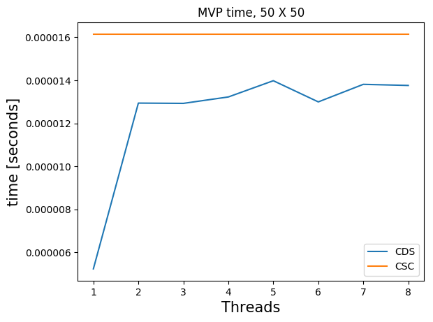
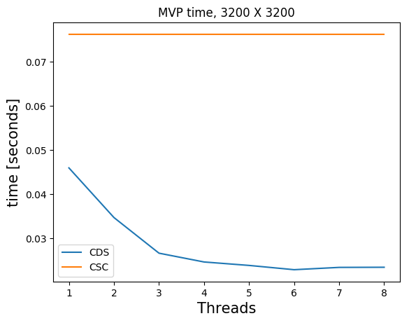
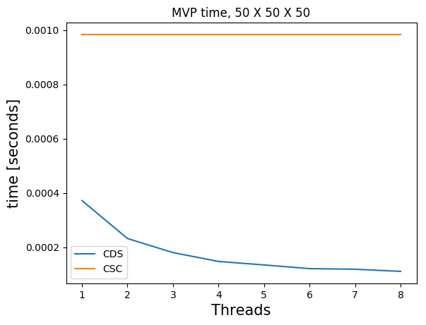
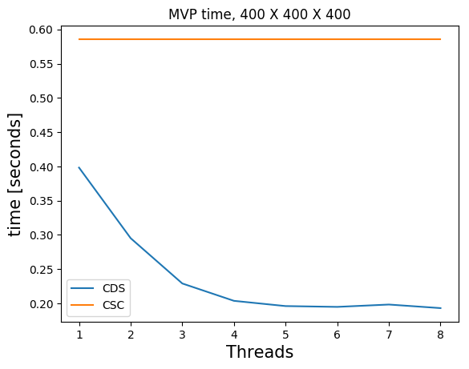
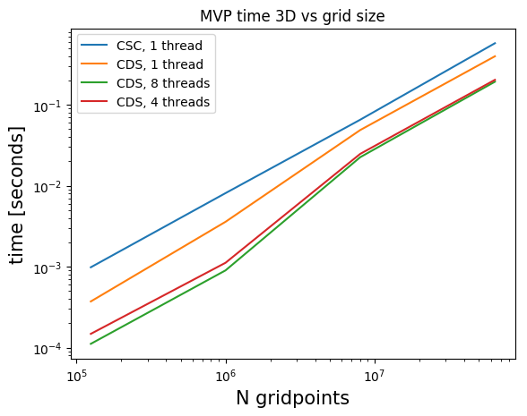

#Sparse matrix-vector products

The standard native `Julia` sparse matrix (`SparseMatrixCSC`) is stored in the compressed sparse column format (CSC). Matrix-vector products with this type of matrix do not use multithreading in Julia (although there is non-Julia software that does use multiple threads and obtains small speedups). 

Many of our matrices ``A``, get a baned structure when we form ``A^\top A``. A banded structure is a matrix that has a small number of diagonals with nonzero elements. For example, if ``A`` is a first-order finite-difference matrix for a 2D domain, ``A^\top A`` also has a banded structure. We store the matrices ``B = A^\top A`` in the compresse diagonal storage format (CDS) (sometimes reffered to as the DIA format) if ``B \in \mathbb{R}^{N \times N}`` has a banded structure. This means we store all ``d`` nonzero diagonals as a dense matrix ``R \in \mathbb{R}^{N \times d}`` and a vector ``n \in \mathbb{R}^d`` with the indices of nonzero diagonals. 

Matrix-vector products in the CDS format are faster for banded matrices and also achieve a nice speedup using multiple threads. The multi-treading is implemented in pure `Julia` using only a few lines of code. 

Below, we compare timings for 2D and 3D models of various sizes for various number of threads on a dedicated cluster node with ``2`` CPUs per node, 10 cores per CPU (Intel Ivy Bridge 2.8 GHz E5-2680v2) and 128 GB memory per node. We show results for matrix-vector producs in the CSC and CDS format for a laplacian matrix. The CSC MVPs in Julia are computed as the transpose of the matrix, which is a bit faster than with the matrix itself. The matrices ``B`` are always symmetric so we don't need to copmute additional transposes of matrices.

### Figure:  MVP-vs-threads {#Fig:MVSP-threads}

\

: Times for matrix-vector products with Laplacian matrices for 2D models (top) and 3D models (bottom). Compressed column storage (CSC, native in `Julia`) and compressed diagonal storage (CDS, our implementation). Multi-threading does not pay off for too small models.

### Figure:  MVP-vs-grid {#Fig:MVSP-grid}

: Times for matrix-vector products with Laplacian matrices for 2D and 3D models. Compressed column storage (CSC, native in `Julia`) and compressed diagonal storage (CDS, our implementation).

