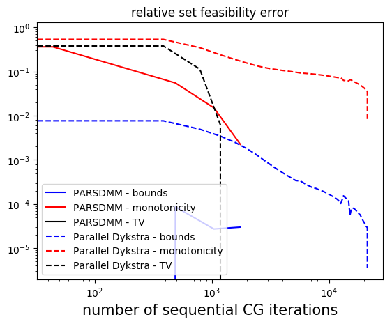
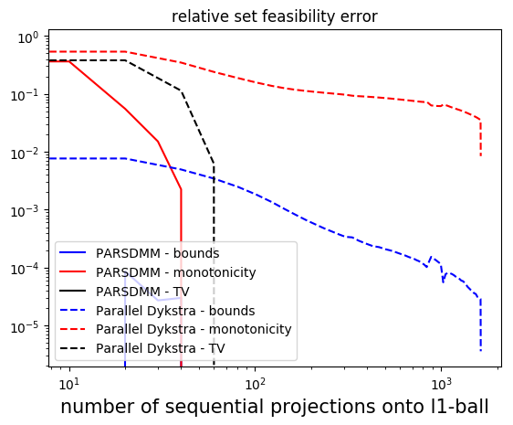
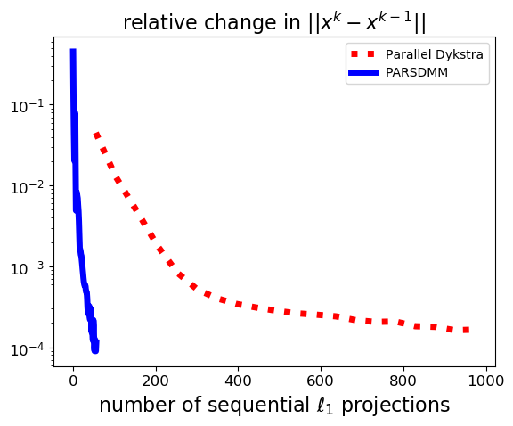
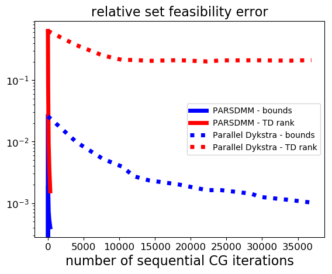
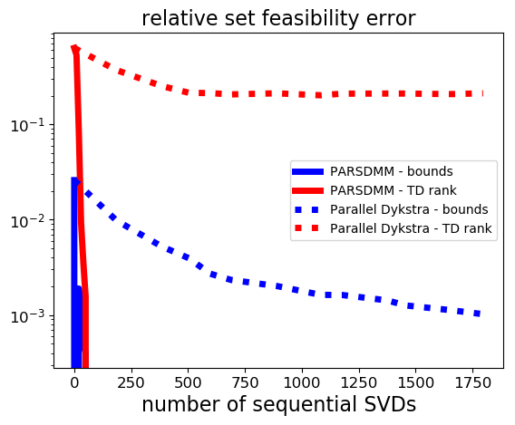
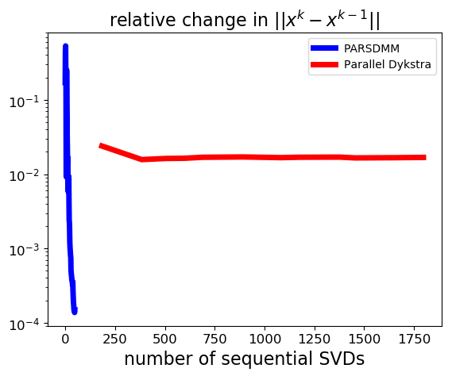
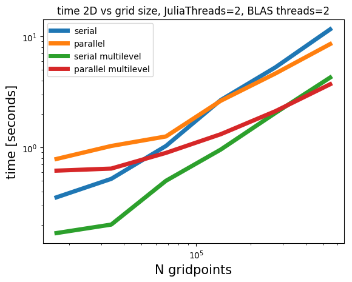
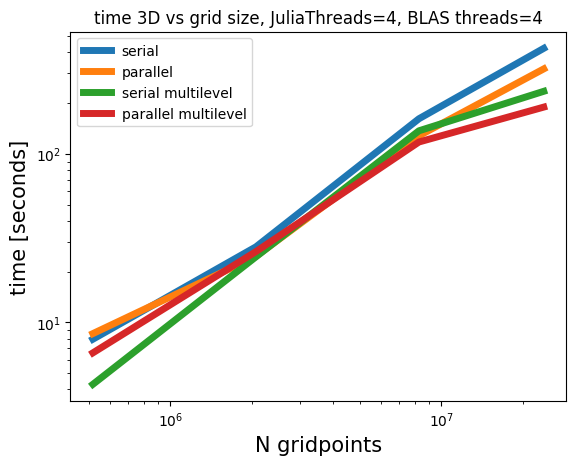
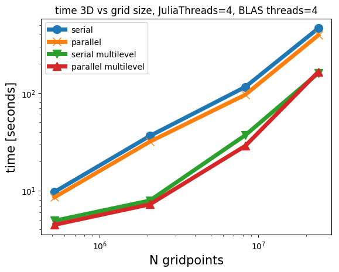

#Performance of Projection Adaptive Relaxed Simultaneous Method of Multipliers (PARSDMM)

To see how the proposed PARSDMM algorithm compares to parallel Dykstra's algorithm, we need to set up a fair experimental setting that includes the sub-problem solver in parallel Dykstra's algorithm. Fortunately, if we use Adaptive Relaxed ADMM (ARADMM) for the projection sub-problems of parallel Dykstra's algorithm, both PARSDMM and Parallel Dykstra-ARADMM have the same computational components. ARADMM also uses the same update scheme for the augmented Lagrangian penalty and relaxation parameters as we use in PARSDMM. This similarity allows for a comparison of the convergence as a function of the basic computational components. We manually tuned ARADMM stopping conditions to achieve the best performance for parallel Dykstra's algorithm overall.
 
The numerical experiment is the projection of a 2D geological model (``341 \times 400`` pixels) onto the intersection of three constraint sets that are of interest to seismic imaging: 

1. ``\{ m \: | \: \sigma_1 \leq m[i] \leq \sigma_2 \}`` : bound constraints 
2. ``\{ m \: | \: \| A m \|_1 \leq \sigma \}`` with ``A = [(I_x \otimes D_z)^\top \:\: (D_x \otimes I_z)^\top]^\top`` : anisotropic total-variation constraints
3. ``\{ m \: | \: 0 \leq ((I_x \otimes D_z) m)[i] \leq \infty \}`` : vertical monotonicity constraints 

For these sets, the primary computational components are *(i)* matrix-vector products in the conjugate-gradient algorithm. The system matrix has the same sparsity pattern as ``A^\top A``, because the sparsity patterns of the linear operators in set number one and three overlap with the pattern of ``A^\top A``. Parallel Dykstra uses matrix-vector products with ``A^\top A``, ``(D_x \otimes I_z)^\top (D_x \otimes I_z)``, and ``I`` in parallel. *(ii)* projections onto the box constraint set and the ``\ell_1``-ball. Both parallel Dykstra's algorithm and PARSDMM compute these in parallel. *(iii)* parallel communication that sends a vector from one to all parallel processes, and one map-reduce parallel sum that gathers the sum of vectors on all workers. The communication is the same for PARSDMM and parallel Dykstra's algorithm so we ignore it in the experiments below. 

Before we discuss the numerical results, we discuss some details on how we count the computational operations mentioned above:

 - Matrix-vector products in CG: At each PARSDMM iteration, we solve a single linear system with the conjugate-gradient method. Parallel Dykstra's algorithm simultaneously computes three projections by running three instances of ARADMM in parallel. The projections onto sets two and three solve a linear system at every ARADMM iteration. For each parallel Dykstra iteration, we count the total number of sequential CG iterations, which is determined by the maximum number of CG iterations for either set number two or three.

- ``\ell_1``-ball projections: PARSDMM projects onto the ``\ell_1`` ball once per iteration. Parallel Dykstra projects (number of parallel Dykstra iterations) ``\times`` (number of ARADMM iterations for set number two) times onto the ``\ell_1`` ball. Because ``\ell_1``-ball projections are computationally more intensive compared to projections onto the box (element-wise comparison) and also less suitable for multi-threaded parallelization, we focus on the ``\ell_1``-ball projections.

We use the following stopping criteria:
```math #stopping_conditions
r^\text{evol} < \varepsilon^\text{evol} \quad \text{and} \quad r^{\text{feas}}_i < \varepsilon^{\text{feas}}_i \quad \forall \: i.
```
with
```math #feas_stop
r^{\text{feas}}_i = \frac{ \| A_i x - \mathcal{P}_{\mathcal{C}_i}(A_i x) \| }{ \| A_i x \| }, \, i=1\cdots p,
```
and
```math #obj_stop
r^\text{evol} = \frac{ \text{max}_{j \in S} \{ \|x^k - x^{k-j}\| \} }{ \|x^k\| },
``` 
where ``S \equiv \{ 1,2,\dots,5 \}``. During our numerical experiments, we select ``\varepsilon^\text{evol}=10^{-2}`` and ``\varepsilon^{\text{feas}}_i = 10^{-3}``, which balance sufficiently accurate solutions and short solution times.

	
The results in Figure #Fig:Dyk-vs-PARSDMM show that PARSDMM requires much fewer CG iterations and ``\ell_1``-ball projections to achieve the same relative set feasibility error in the transform-domain as defined in equation (#feas_stop). Different from the curves corresponding to parallel Dykstra's algorithm, we see that PARSDMM converges somewhat oscillatory, which is caused by changing the relaxation and augmented-Lagrangian penalty parameters.

### Figure:  Dykstra-vs-PARSDMM {#Fig:Dyk-vs-PARSDMM .wide}



: Relative transform-domain set feasibility (equation #feas_stop\) as a function of the number of conjugate-gradient iterations and projections onto the ``\ell_1`` ball. This figure also shows relative change per iteration in the solution ``x``.

Because non-convex sets are an important application for us, we compare the performance for a non-convex intersection as well:

1. ``\{ m \: | \: \sigma_1 \leq m[i] \leq \sigma_2 \}``: bound constraints
2. ``\{ m \: | \: (I_x \otimes D_z) m = \operatorname{vec}( \sum_{j=1}^{r}\lambda[j] u_j v_j^* )\}``, where ``r < \text{min}(n_z,n_x)``, ``\lambda[j]`` are the singular values, and ``u_j``, ``v_j`` are singular vectors: rank constraints on the vertical gradient of the image 

We count the computational operations in the same way as in the previous example, but this time the computationally most costly projection is the projection onto the set of matrices with limited rank via the singular value decomposition. The results in Figure #Fig:Dyk-vs-PARSDMM2 show that the convergence of parallel Dykstra's algorithm almost stalls: the solution estimate gets closer to satisfying the bound constraints, but there is hardly any progress towards the rank constraint set. PARSDMM does not seem to suffer from non-convexity in this particular example.

### Figure:  Dykstra-vs-PARSDMM {#Fig:Dyk-vs-PARSDMM2 .wide}



: Relative transform-domain set feasibility (equation #feas_stop) as a function of the number of conjugate-gradient iterations and projections onto the set of matrices with limited rank via the SVD. This figure also shows relative change per iteration in the solution ``x``.

We used the single-level version of PARSDMM such that we can compare the computational cost with Parallel Dykstra. The PARSDMM results in this section are therefore pessimistic in general, as the multilevel version can offer additional speedups, which we show next.

### Some timings for 2D and 3D projections
We show timings for projections of geological models onto two different intersections for the four modes of operation: PARSDMM, parallel PARSDMM, multilevel PARSDMM, and multilevel parallel PARSDMM. As we mentioned, the multilevel version has a small additional overhead compared to single-level PARSDMM because of one interpolation procedure per level. Parallel PARSDMM has communication overhead compared to serial PARSDMM. However, serial PARSDMM still uses multi-threading for projections, the matrix-vector product in the conjugate-gradient method, and BLAS operations, but the ``y_i`` and ``v_i`` computations in Algorithm #alg:PARSDMM remain sequential for every ``i=1,2,\cdots,p, p+1``, contrary to parallel PARSDMM. We carry our computations out on a dedicated cluster node with ``2`` CPUs per node with 10 cores per CPU (Intel Ivy Bridge 2.8 GHz E5-2680v2) and 128 GB of memory per node.

The following sets are used to regularize a geophysical inverse problem and form the intersection for our first test case: 

1. ``\{ m \: | \: \sigma_1 \leq m[i] \leq \sigma_2 \}`` : bound constraints
2. ``\{ m \: | \: -\sigma_3 \leq ((D_x \otimes I_z) m)[i] \leq \sigma_3 \}``: lateral smoothness constraints. There are two of these constraints in the 3D case: for the ``x`` and ``y`` direction separately.
3. ``\{ m \: | \: 0 \leq ((I_x \otimes D_z) m)[i] \leq \infty \}`` : vertical monotonicity constraints

The results in Figure #Fig:timings-1 show that the multilevel strategy is much faster than the single-level version of PARSDMM. The multilevel overhead costs are thus small compared to the speedup. It also shows that, as expected, the parallel versions require some communication time, so the problems need to be large enough for the parallel version of PARSDMM to offer speedups compared to its serial counterpart.


### Figure: timings-1 {#Fig:timings-1}


: Timings for a 2D and 3D example where we project a geological model onto the intersection of bounds, lateral smoothness, and vertical monotonicity constraints.

The previous example uses four constraint sets that each use a different linear operator, but all of them are a type of bound constraint. We now show an example where one of the sets uses a much more time-consuming projection computation than the other set, which leads to the expectation that parallel PARSDMM only offers minor speedups compared to serial PARSDMM. The second constraint set onto which we project is the intersection of:

1. ``\{ m \: | \: \sigma_1 \leq m[i] \leq \sigma_2 \}`` : bound constraints
2. ``\{ m \: | \: \|(I_x \otimes I_y \otimes D_z) m \|_1 \leq \sigma_3 \}``, with a constraint that is ``50\%`` of the true model: ``\sigma_3 = 0.5 \|(I_x \otimes I_y \otimes D_z) m_* \|_1`` : directional anisotropic total-variation

Figures #Fig:timings-1 and #Fig:timings-2 show that parallel computations of the projections in PARSDMM is not always beneficial, depending on the number of constraint sets, model size, and time it takes to project onto each set.


### Figure: timings-2 {#Fig:timings-2}

: Timings for a 3D example where we project a geological model onto the intersection of bound constraints and an ``\ell_1``-norm constraint on the vertical derivative of the image. Parallel computation of the projections does not help in this case, because the ``\ell_1``-norm projection is much more time consuming than the projection onto the bound constraints. The time savings for other computations in parallel are then canceled out by the additional communication time.

```math_def
\def\bb{\mathbf b}
\def\bc{\mathbf c}
\def\bd{\mathbf d}
\def\bg{\mathbf g}
\def\bh{\mathbf h}
\def\bl{\mathbf l}
\def\bm{\mathbf m}
\def\bp{\mathbf p}
\def\bq{\mathbf q}
\def\br{\mathbf r}
\def\bs{\mathbf s}
\def\bu{\mathbf u}
\def\bv{\mathbf v}
\def\bw{\mathbf w}
\def\by{\mathbf y}
\def\bx{\mathbf x}
\def\bz{\mathbf z}
%\def\argmin{\operatornamewithlimits{arg min}}
\def\argmin{\mathop{\rm arg\min}}
```
