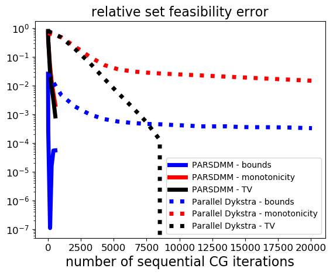
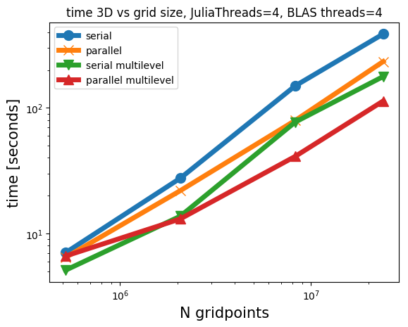

#Performance of Projection Adaptive Relaxed Simultaneous Method of Multipliers (PARSDMM)

This example compares the computational cost of parallel Dykstra and PARSDMM for a 2D problem where we project onto the intersection of:

1. bound constraints: ``\{ \bm \: | \: \bl_i \leq \bm_i \leq \bu_i \}``
2. anisotropic total-variation constraints: ``\{ \bm \: | \: \| A \bm \|_1 \leq \sigma \}`` with ``A = ((I_{n_x} \otimes D_z)^T \: (D_x \otimes I_{n_z})^T)^T``
3. vertical monotonicity constraints: ``\{ \bm \: | \: \bl_i \leq (I_{n_x} \otimes D_z) \bm)_i \leq \bu_i \}`` with all ``\bu_i = \infty`` and ``\bl_i = 0``.

Parallel Dykstra and PARSDMM have the same computational components so we can compare convergence in terms of the basic computational pieces. The projections onto the sets described above are computed with the ARADMM algorithm [@2017arXiv170402712X], which is effectively PARSDMM if the input is only one projector and transform-domain operator pair. We manually tuned ARADMM stopping conditions to achieve the best performance for parallel Dykstra overall.   

Each PARSDMM iteration solves a linear system with CG. Parallel Dykstra computes three projections simultaneously and sets two and three repeatedly solve a linear system. We count the total number of sequential CG iterations, which is determined by the maximum number of CG iterations (for either set two or set three) per parallel Dykstra iteration.

We also compare parallel Dykstra versus PARSDMM in terms of ``\ell_1``-ball projections. PARSDMM projects onto the ``\ell_1``-ball once per iteration. Parallel Dykstra projects (number of Dykstra iterations) ``\times`` (number of ARADMM iterations) times onto the ``\ell_1``-ball.

Figure #Fig:Dyk-vs-PARSDMM shows that PARSDMM requires much fewer CG iterations or ``\ell_1``-ball projections to achieve the same relative set feasibility error in the transform-domain as defined in Equation (#feas_stop). We observe very fast convergence for parallel Dykstra in the end because the sub-problem projections with ARADMM only require a few iterations (or no iterations at all) at that point. The PARSDMM-TV line does not show up, that constraint is already satisfied at the first measurement point for feasibility.

### Figure:  Dykstra-vs-PARSDMM {#Fig:Dyk-vs-PARSDMM .wide}



: Relative transform-domain set feasibility (Equation #feas_stop\) as a function of conjugate-gradient iterations and projections onto the ``\ell_1``-ball. Also shows relative change in squared distance from the point to project.

### Some timings for 2D and 3D projections
The proposed PARSDMM algorithm is suitable for small 2D (``50 \times 50`` pixels) up to 3D models (``\approx 300^3``). We show some timings for projections onto two different intersections for the four modes of operation: PARSDMM, parallel PARSDMM, multilevel PARSDMM, and multilevel parallel PARSDMM. The multilevel version has a small additional overhead compared to single level PARSDMM. The parallel version of PARSDMM has communication overhead compared to serial PARSDMM. Serial PARSDMM will still use multi-threading to compute the projections and for the BLAS operations, but the ``\by_i`` and ``\bl_i`` computations in Algorithm (#alg:PARSDMM) are sequential. Timings are determined on a dedicated cluster node with 20 processors (insert type details).

The first projection is onto the intersection of

1. bound constraints: ``\{ \bm \: | \: \bl_i \leq \bm_i \leq \bu_i \}``
2. lateral smoothness constraints: ``\{ \bm \: | \: \bl_i \leq (D_x \otimes I_{n_z}) \bm)_i \leq \bu_i \}`` with all ``\bu_i = \varepsilon`` and ``\bl_i = - \varepsilon``
3. vertical monotonicity constraints: ``\{ \bm \: | \: \bl_i \leq (I_{n_x} \otimes D_z) \bm)_i \leq \bu_i \}`` with all ``\bu_i = \infty`` and ``\bl_i = 0``.


### Figure: timings-1 {#Fig:timings-1 .wide}

\
: timings for a 2D and 3D example where we project an image onto the intersection of bound constraints, lateral smoothness constraints and vertical monotonicity constraints. Results are shown for four different grid sizes.

The second constraint set onto which we project is the intersection of

1. bound constraints
2. nuclear norm constraints on the vertical derivative of the image
Figure (#Fig:timings-2) displays the results.

### Figure: timings-2 {#Fig:timings-2 .wide}

\
: timings for a 2D and 3D example where we project an image onto the intersection of bound constraints and a nuclear norm constraint on the vertical derivative of the image. Results are shown for four different grid sizes.

```math_def
\def\bb{\mathbf b}
\def\bc{\mathbf c}
\def\bd{\mathbf d}
\def\bg{\mathbf g}
\def\bh{\mathbf h}
\def\bl{\mathbf l}
\def\bm{\mathbf m}
\def\bp{\mathbf p}
\def\bq{\mathbf q}
\def\br{\mathbf r}
\def\bs{\mathbf s}
\def\bu{\mathbf u}
\def\bv{\mathbf v}
\def\bw{\mathbf w}
\def\by{\mathbf y}
\def\bx{\mathbf x}
\def\bz{\mathbf z}
%\def\argmin{\operatornamewithlimits{arg min}}
\def\argmin{\mathop{\rm arg\min}}
```