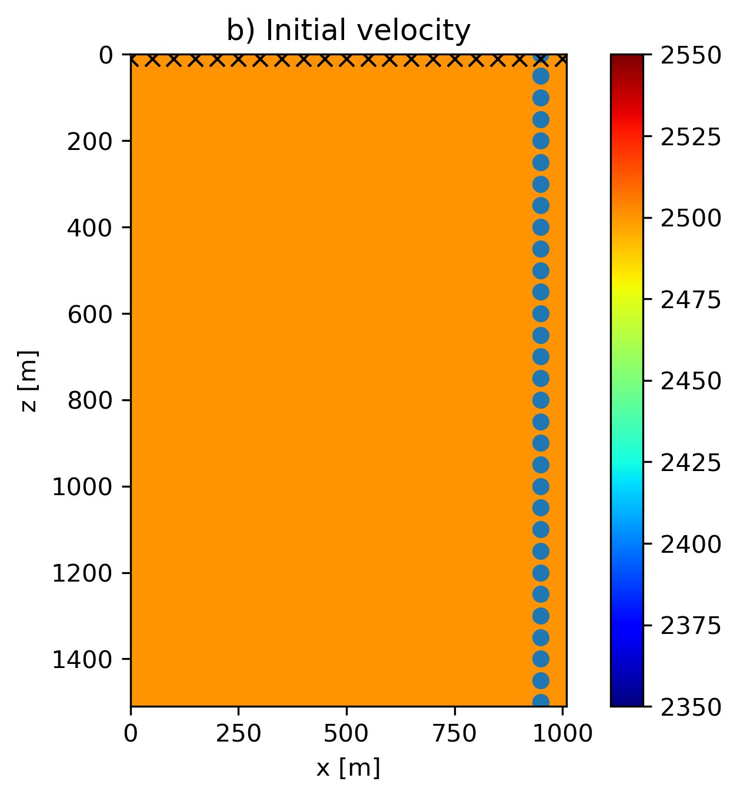
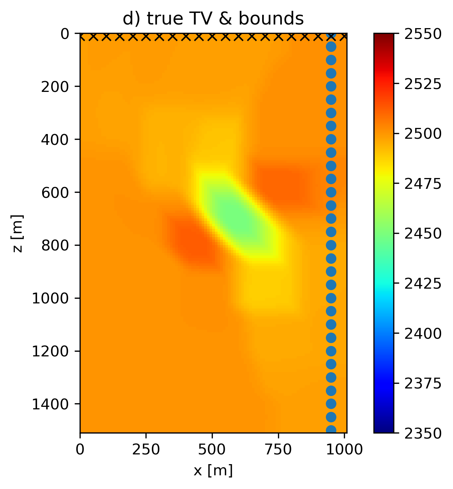
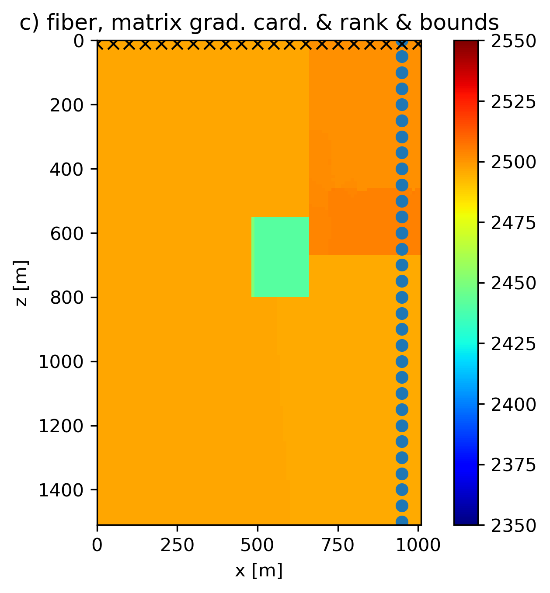

# Frequency domain Full-Waveform Inversion (FWI) with constraints

[Julia script for this example](https://github.com/slimgroup/SetIntersectionProjection.jl/blob/master/examples/constrained_freq_FWI_simple.jl)


Seismic full-waveform inversion (FWI) estimates rock properties (acoustic velocity in this example) from seismic signals (pressure) measured by hydrophones. FWI is a partial-differential-equation (PDE) constrained optimization problem where after eliminating the PDE constraint, the simulated data, ``d_\text{predicted}(m) \in \mathbb{C}^M``, are connected nonlinearly to the unknown model parameters, ``m \in \mathbb{R}^N``. We assume that we know the source and receiver locations, as well as the source function. A classic example of an objective for FWI is the nonlinear least-squares misfit ``f(m)=1/2 \| d_\text{obs} - d_\text{predicted}(m) \|_2^2``, which we use for this numerical experiment.

FWI is a problem hampered by local minima. Empirical evidence suggests that we can mitigate issues with parasitic local minima by insisting that all model iterates be elements of the intersection of multiple constraint sets. This means that we add regularization to the objective ``f(m) : \mathbb{R}^N \rightarrow \mathbb{R}`` in the form of multiple constraints---i.e., we have
```math #FWI_prob
\min_{m} f(m) \quad \text{s.t.} \quad m \in \mathcal{V} = \bigcap_{i=1}^p \mathcal{V}_i.
```

While many choices exist to solve this constrained optimization problem, we use the spectral projected gradient (SPG) algorithm with a non-monotone line search to solve the above problem. SPG uses information from the current and previous gradient of ``f(m)`` to approximate the action of the Hessian of ``f(m^k)`` with the scalar ``\alpha``: the Barzilai-Borwein step length. At iteration ``k``, SPG updates the model iterate as follows:
```math #SPG_iter
m^{k+1} = (1-\gamma) m^k - \gamma \mathcal{P}_{\mathcal{V}} (m^k - \alpha \nabla_{m}f(m^k)),
```
where the non-monotone line search determines ``\gamma \in (0,1]``.

The prior knowledge consists of: *(a)* minimum and maximum velocities (``2350 - 2650`` m/s); *(b)* The anomaly is, but we do not know the size, aspect ratio, or location. The following constraint sets follow from the prior information: 

 1. ``\{ x \: | \: \operatorname{card}( (D_z \otimes I_x) x ) \leq n_x \}``
 2. ``\{ x \: | \: \operatorname{card}( (I_z \otimes D_x) x ) \leq n_z \}``
 3. ``\{ x \: | \: \operatorname{rank}(x) \leq 3 \}``
 4. ``\{ x \: | \: 2350 \leq x[i] \leq 2650 \: \forall i\}``
 5. ``\{ x \: | \: \operatorname{card}( D_x X[i,:] ) \leq 2 \:\: \text{for} \:\: i \in \{1,2,\dots,n_z\} \}``,  ``X[i,:]`` is a row of the 2D model
 6. ``\{ x \: | \: \operatorname{card}( D_z X[:,j] ) \leq 2 \:\: \text{for} \:\: j \in \{1,2,\dots,n_x\}\}``,  ``X[:,j]`` is a column of the 2D model

We use slightly overestimated rank and matrix cardinality constraints compared to the true model to mimic the more realistic situation that not all prior knowledge was correct. The results in Figure #Fig:FWI use single-level PARSDMM to compute projections onto the intersection of constraints, and show that an intersection of non-convex constraints and bounds can lead to improved model estimates. Figure #Fig:FWI(e) is the result of working with constraints ``[1,2,4]``, Figure #Fig:FWI(f) uses constraints ``[1,2,4,5,6]``, and Figure #Fig:FWI(g) uses all constraints ``[1,2,3,4,5,6]``. The result with rank constraints and both matrix and row/column-based cardinality constraints on the discrete gradient of the model is the most accurate in terms of the recovered anomaly shape. All results in Figure #Fig:FWI that work with non-convex sets are at least as accurate as the result obtained with the true TV in terms of anomaly shape. Another important observation is that all non-convex results estimate a lower-than-background velocity anomaly, although not as low as the true anomaly. Contrary, the models obtained using convex sets show incorrect higher-than-background velocity artifacts in the vicinity of the true anomaly location.

Figure #Fig:FWI-2 is the same as Figure #Fig:FWI, except that we use multilevel PARSDMM with three levels and a coarsening of a factor two per level. The multilevel version of PARSDMM performs better in general. In Figures #Fig:FWI(e) and #Fig:FWI(f), we see that the result of single-level PARSDMM inside SPG does not exactly satisfy constraint set numbers ``5`` and ``6``, because the cardinality of the derivative of the model in ``x`` and ``z`` directions is not always less than or equal to two for each row and column. The results from multilevel PARSDMM inside SPG, Figure #Fig:FWI-2(a) and #Fig:FWI-2(b), satisfy the constraints on the cardinality of the derivative of the image per row and column. As a result, the models are closer to the rectangular shape of the true model. This is only one example with a few different constraint combinations so we cannot draw general conclusions about the performance of single versus multilevel schemes, but the empirical findings are encouraging.

### Figure:  FWI-true {#Fig:FWI .wide}
{width=33%}
{width=33%}\
{width=33%}
{width=33%}\
{width=33%}
{width=33%}
{width=33%}
: True, initial, and estimated models with various constraint combinations for the full-waveform inversion example. Crosses and circles represent sources and receivers, respectively. All projections inside the spectral projected gradient algorithm are computed using single-level PARSDMM.

### Figure:  FWI-2 {#Fig:FWI-2 .wide}
{width=33%}
{width=33%}
{width=33%}
: Estimated models with various constraint combinations for the full-waveform inversion example. Crosses and circles represent sources and receivers, respectively. All projections inside the spectral projected gradient algorithm are computed using coarse-to-fine multilevel PARSDMM with three levels and a coarsening of a factor two per level.
