#Image processing by learning a parametric intersection of (non-)convex sets

[Julia script for this example a) (joint image denoising+deblurring+inpainting)](../examples/Ecuador_deblurring_inpainting/deblurring_inpainting_by_constraint_learning_SA.jl)

[Julia script for this example b) (image desaturation)](../examples/Indonesia_deblurring/image_desaturation_by_constraint_learning.jl)

The applications of interest for this example are linear inverse problems, such as removing motion blur with a known blurring kernel and inpainting of missing pixels, single-image super-resolution, denoising, and desaturation of saturated images. We use aerial photos as the target. We can solve these various image processing tasks with the following simple strategy:

1. Observe (learn) the parameters of various constraint sets in various transform-domains by looking at just a few representative training images.
2. Add a constraint set for data-fit 
2. Project a noisy/saturated/blurred/masked image onto the intersection of the learned (model properties) sets and data-fit set.
3. The projection of the corrupted image should now have similar properties as good training images.

We formulate the projection problem as
```math #proj_intersect_lininvprob2
\min_{\bx,\by_i} \frac{1}{2}\| \bx - \bm \|_2^2 + \sum_{i=1}^{p-1} \iota_{\mathcal{C}_i}(\by_i) + \iota_{\mathcal{C}_p^\text{data}}(\by_p)\quad \text{s.t.} \quad \begin{cases}
A_i \bx = \by_i \\ B\bx=\by_p
\end{cases}
```
and solve it with the PARSDMM algortihm. This is a linear inverse problem with forward/observation operator, ``B \in \mathbb{R}^{M \times N}``, model estimation ``\bx \in \mathbb{R}^N`` and the observed data ``\bd_\text{obs} \in \mathbb{R}^M``. The solution is the projection of the initial guess ``\bm`` onto the intersection of constraint sets that describe the model ``\bx`` and a data constraint set ``\mathcal{C}_p^{\text{data}}``. Examples of data-fit constraints are ``\{ \bx \: | \: \bl \leq (B \bx - \bd_\text{obs}) \leq \bu\}`` and ``\{ \bx \: | \: \| B \bx - \bd_\text{obs} \|_2 \leq \sigma \}``. 

For both examples we observe the following constraint parameters:
 
1. upper and lower bounds: ``\{ \bm \: | \: \bl_i \leq \bm_i \leq \bu_i \}``
2. nuclear norm: ``\{ \bm \: | \:  \sum_{j=1}^k \lambda_j  \leq \sigma \}``, with ``\bm = \textbf{vec}( \sum_{j=1}^{k}\lambda_j \bu_j \bv_j^* )`` is the SVD of the image
3. nuclear norm of discrete gradients of the image (total-nuclear-variation): ``\{ \bm \: | \:  \sum_{j=1}^k \lambda_j  \leq \sigma \}``, with ``(I_{n_x} \otimes D_z)\bm = \textbf{vec}( \sum_{j=1}^{k}\lambda_j \bu_j \bv_j^* )`` is the SVD of the vertical derivative of the image, same for the other direction
4. anisotropic total-variation: ``\{ \bm \: | \: \| A \bm \|_1 \leq \sigma \}`` with ``A = ((I_{n_x} \otimes D_z)^T \: (D_x \otimes I_{n_z})^T)^T``
5. annulus: ``\{ \bm \: | \: \sigma_l \leq \| \bm \|_2 \leq \sigma_u \}``
6. annulus of the discrete gradients of the training images:  ``\{ \bm \: | \: \sigma_l \leq \| A \bm \|_2 \leq \sigma_u \}`` with ``A = ((I_{n_x} \otimes D_z)^T \: (D_x \otimes I_{n_z})^T)^T``
7. ``\ell_1``-norm of DFT coefficients: ``\{ \bm \: | \: \| A \bm \|_1 \leq \sigma \}`` with ``A = `` discrete Fourier transform
8. slope-constraints in x and z direction (bounds on the discrete gradients of the image): ``\{ \bm \: | \: \bl_i \leq (D_x \otimes I_{n_z}) \bm)_i \leq \bu_i \}`` with all ``\bu_i = \varepsilon_u`` and ``\bl_i = - \varepsilon_l``, same for z-direction
9. point-wise bound-constraints on DCT coefficients: ``\{ \bm \: | \: \bl_i \leq (A \bm)_i \leq \bu_i \}``, with ``A=`` discrete cosine transform

We also add a point-wise data-fit constraint, ``\{ \bx \: | \: \bl \leq (B \bx - \bd_\text{obs}) \leq \bu\}``.

## Example 1: joint denoising-deblurring-inpainting
The goal of the first example is to recover an image from ``20\%`` observed pixels of a blurred image (25 pixels known motion blur), where each observed data-point also contains a small amount of random noise in the interval ``[-2 - 2]``. The dataset is a series of images from 'Planet Labs PlanetScope Ecuador' with a resolution of three meters, available at openaerialmap.org. There are ``35`` patches (``1100 \times 1100`` pixels) for training and Figure #Fig:inpainting-deblurring-evaluation shows the results. 

We compare our results with the solution of ``\min \|\bx\|_\text{TV} \:\: \text{s.t.} \:\: \|B \bx - \bd_\text{obs} \|_2 \leq \sigma`` (TV-BPDN), computed with the Matlab package TFOCS. We used TFOCS with a very small (TFOCS parameter ``\mu=1e-5``) additional smoothing and ran the iterations until the solution signal to noise ratio (SNR) did not further improve. Additionally, we compare the results when we recover the wavelet coefficients, ``\mathbf{c}``, by solving ``\min \| \mathbf{c} \|_1 \:\: \text{s.t.} \:\: \|B W^* \mathbf{c} - \bd_\text{obs} \|_2 \leq \sigma`` (TV-wavelet) with the SPGL1 toolbox for Matlab. The matrix ``W`` represents the wavelet transform. The learned set intersection approach achieves higher SNR for all evaluation images than the basis-pursuit denoise formulation tested with total-variation and with Wavelets (Daubechies wavelets as implemented by the SPOT linear operator toolbox (http://www.cs.ubc.ca/labs/scl/spot/index.html) and computed with the Rice Wavelet Toolbox (RWT, github.com/ricedsp/rwt)).


### Figure:  inpainting {#Fig:inpainting-deblurring-training .wide}
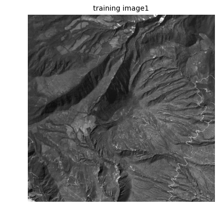
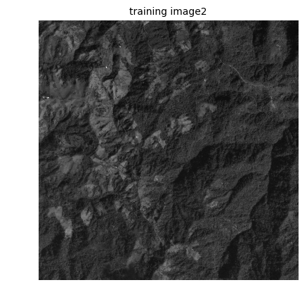

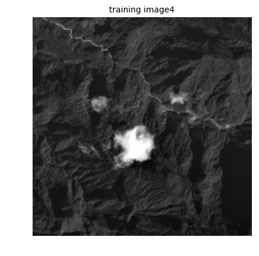\
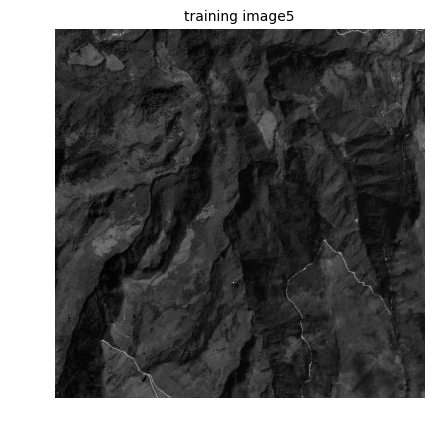
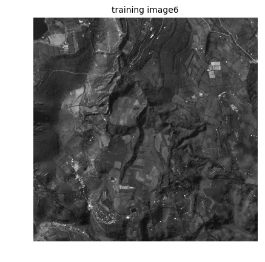
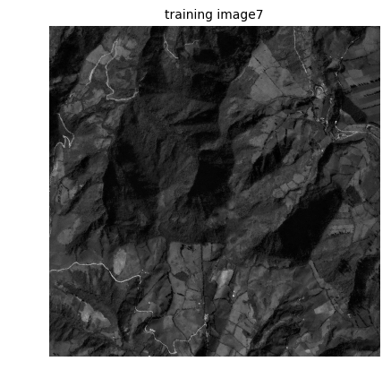
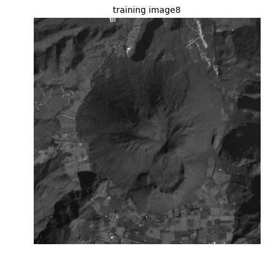
: A sample of ``8`` out of ``35`` training images.

### Figure:  inpainting {#Fig:inpainting-deblurring-evaluation .wide}
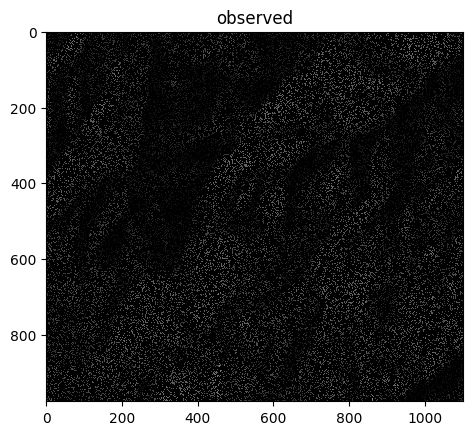
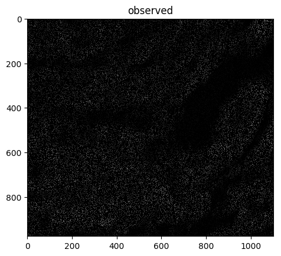
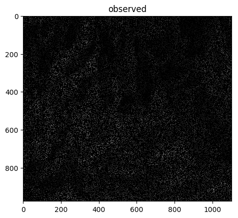
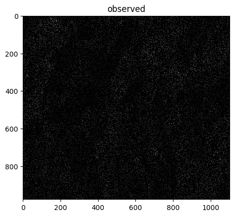\
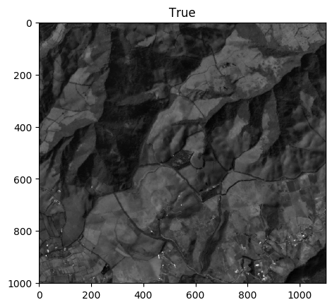
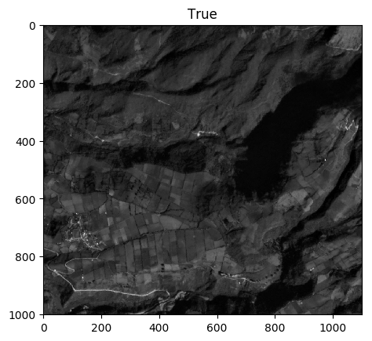

\
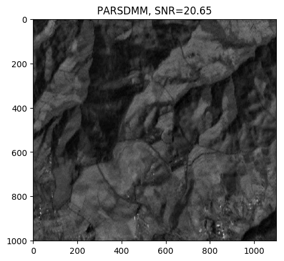
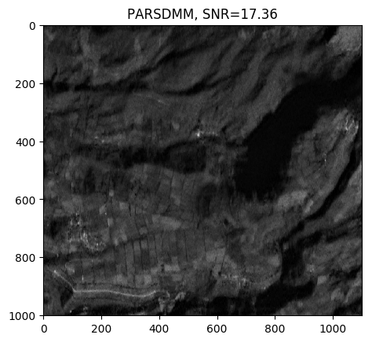
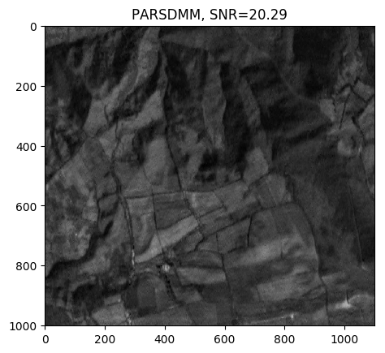
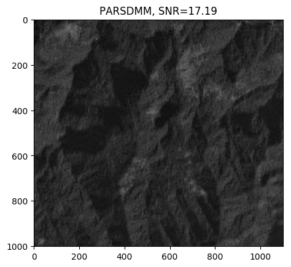\
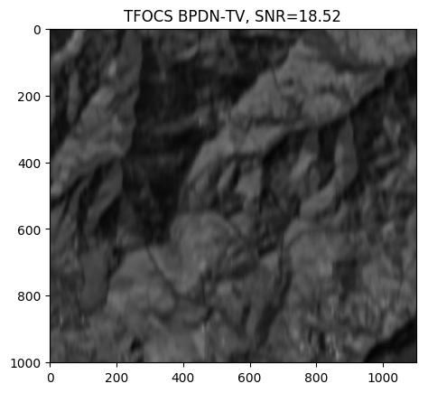
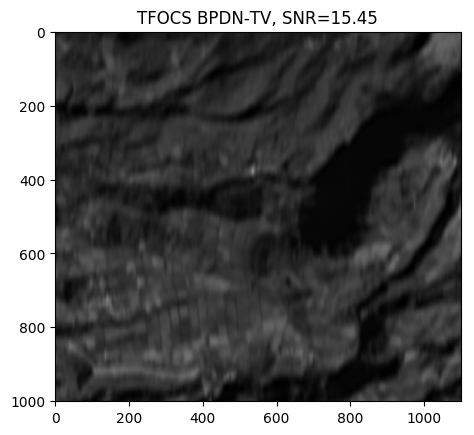
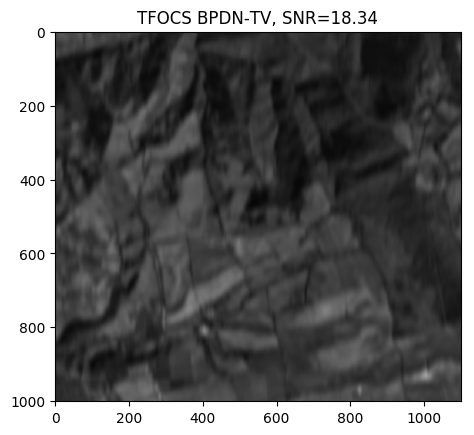
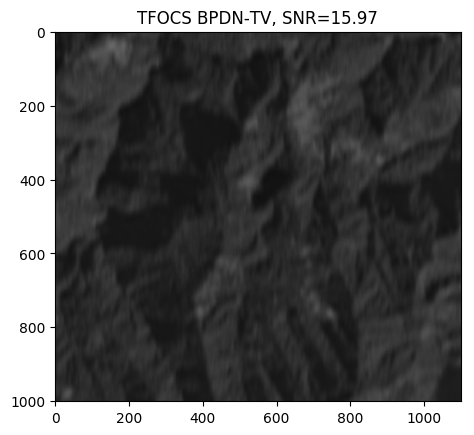\
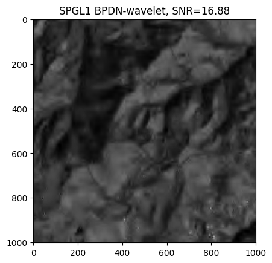
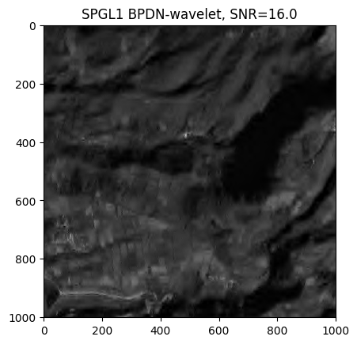
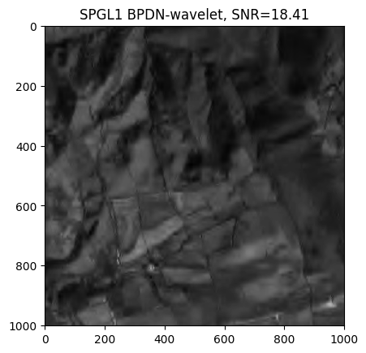
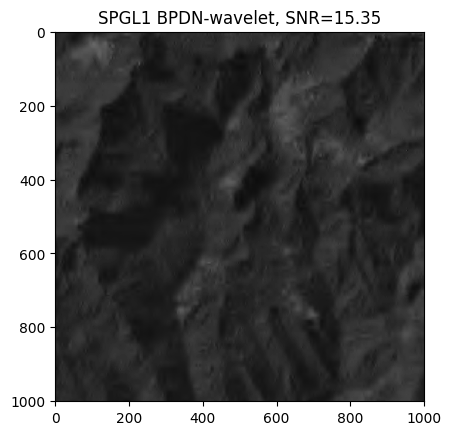
: Reconstruction results from 80% missing pixels of an image with motion blur (25 pixels) and noise for PARSDMM with many learned constraints, BPDN-total-variation with TFOCS and BPDN-wavelet with SPGL1.

## Example 2: Image desaturation
We will now apply exactly the same strategy and algorithm to a different inverse problem. We only need to re-observe the constraint set parameters from a new set of training images (Figure #Fig:deblurring-training) and change our forward operator ``B``.
The second data set contains image patches from the 'Desa Sangaji Kota Ternate' image with a resolution of ``11`` centimeters and size of ``1500 \times 1250`` pixels, available at openaerialmap.org. (https://map.openaerialmap.org/#/-44.12109374999999,0,2/latest/5a17b890bac48e5b1c2f3b75?_k=4ag2c0). The observed images are saturated grayscale and generated by clipping the pixel values from ``0 - 60`` to ``60`` and from ``125 - 255`` to ``125``. There is saturation on both the dark and bright pixels, but much stronger saturation on the high-intensity pixels than on the low-intensity ones. If we have no other information about the pixels at the clipped value, the desaturation problem implies the point-wise bound constraints

```math #saturation_constraint
\begin{cases}
0 \leq \bx_i \leq 60 & \text{if } \bd^{\text{obs}}_i =60\\
\bx_i = \bd^{\text{obs}}_i & \text{if } 60 \leq \bd^{\text{obs}}_i \leq 125\\
125 \leq \bx_i \leq 255 & \text{if } \bd^{\text{obs}}_i = 125\\
\end{cases}.
```
The forward operator is thus the identity matrix, ``B=I_N``. Other approaches also use this constraint for desaturation. We compare our results to a basis-pursuit denoise formulation that solves ``\min_\bx \|A \bx\|_1 \:\: \text{s.t} \:\: \bl_i \leq \bx_i \leq \bu_i``, where ``i`` indexes the elements of the vectors and the bound constraints are as described above by Equation (#saturation_constraint). The transform-domain matrix is the anisotropic total-variation operator. That work who also incorporates pre-processing and windowing techniques in the desaturation workflow for color images. We do not use any pre-processing and work with the full image. 

### Figure:  desaturation {#Fig:deblurring-training .wide}
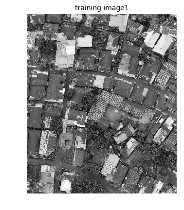
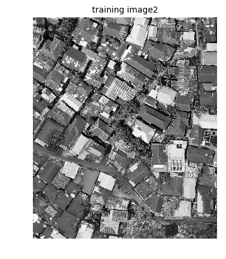
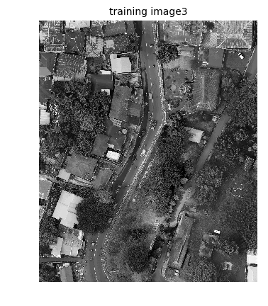
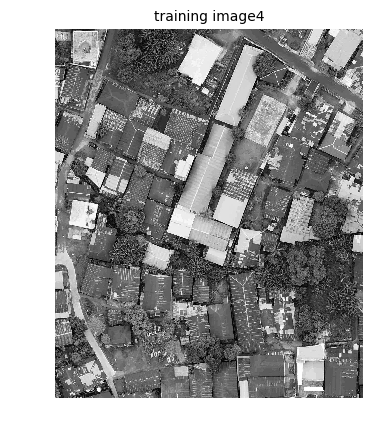\
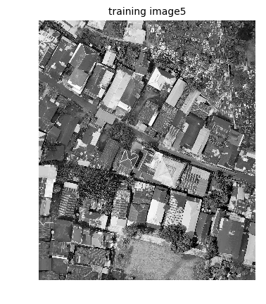
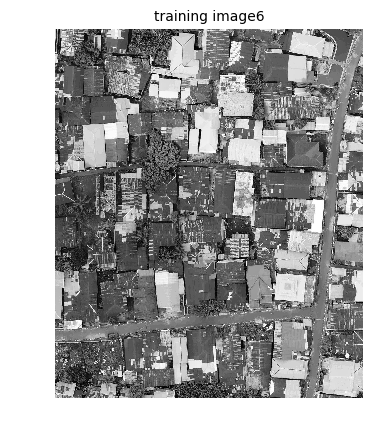
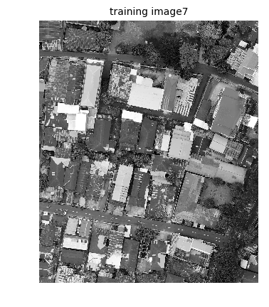
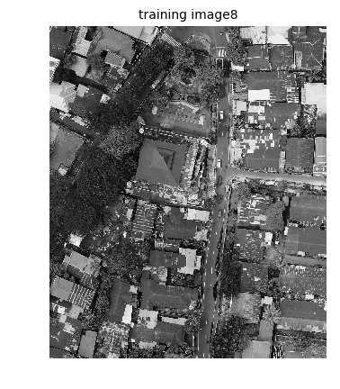
: A sample of ``8`` out of ``16`` training images.

Figure #Fig:desaturation-evaluation shows the results, true and observed data for four evaluation images. PARSDMM with learned parameters for preset constraints achieves a similar or slightly better SNR than minimization of the total-variation subject to a data-fit constraint. Both methods have problems with large saturated patches because there are no non-saturated observed pixels that serve as 'anchor' points. A difference between the BPDN and the projection onto intersection approach is how each method estimates large saturated patches. The TV-BPDN approach minimizes the total-variation, which means that the difference between the estimated pixel values of the saturated patches and the surrounding pixels needs to be as small as possible. The surrounding pixels are all ``\leq 125``, so the estimated pixel values of large saturated patches are therefore also not exceeding ``125``. The projection onto intersection approach does have this problem, because one of the constraints requires a sufficiently small total-variation that is based on a few representative training examples, instead of minimizing the total-variation. As we can see in Figure (#Fig:desaturation-evaluation), the results from PARSDMM seem to recover better the intensity of large saturated patches (and sometimes overestimate) and have a better visual contrast than the BPDN results. Although the SNR does not clearly reveal this, the histograms of estimated pixel values show this effect. The projection onto a set intersection results are just one sample out of the feasible set. Different initial guesses may result in different projected points. We could compute multiple projections to obtain a sense of the estimation uncertainty.

### Figure:  desaturation_results {#Fig:desaturation-evaluation}
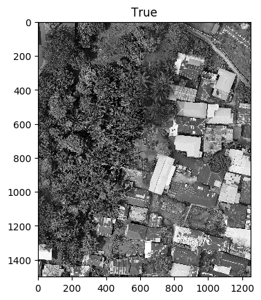
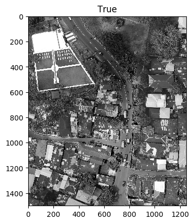
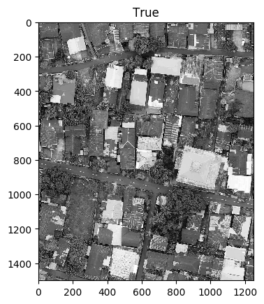
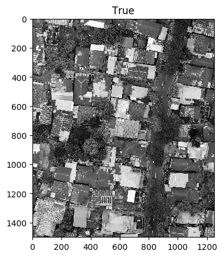\
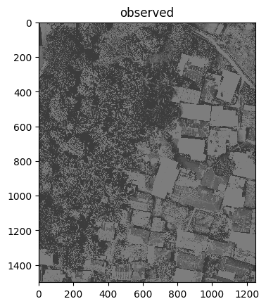

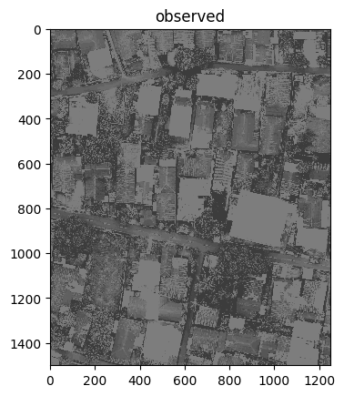
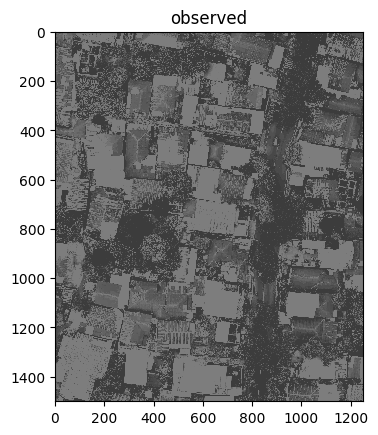\
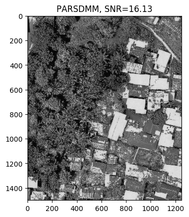
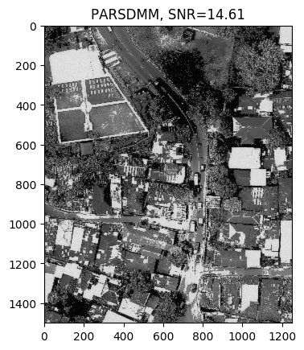
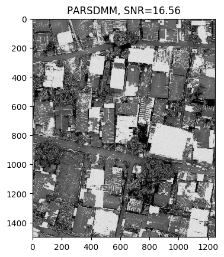
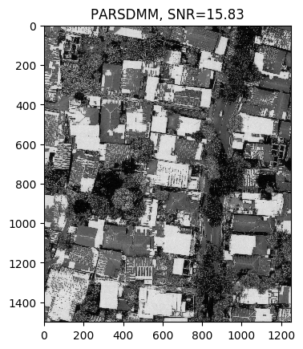\
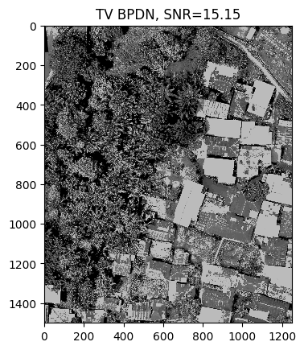
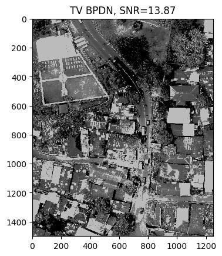
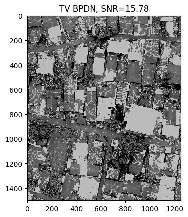
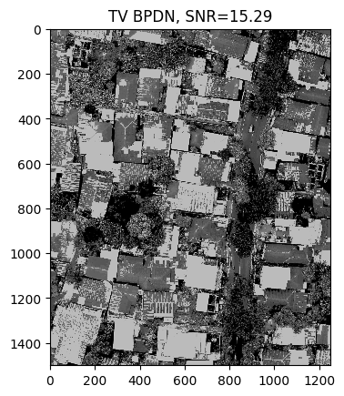
: Reconstruction results from recovery from saturated images of PARSDMM with ``10`` constraints and BPDN-total-variation.

### Figure:  desaturation_results {#Fig:desaturation-histograms .wide}
{width=25%}
{width=25%}
{width=25%}
{width=25%}\
{width=25%}
{width=25%}
{width=25%}
{width=25%}
: Histograms of reconstruction results from recovery from saturated images of PARSDMM with ``10`` constraints and BPDN-total-variation. The opaque (blue) histogram is the true image, the semi-transparant (brown) histogram corresponds to the recovered image.

Both examples show that PARSDMM with convex and non-convex sets converges to the desired feasibility tolerance and the results are similar or better than the basis-pursuit denoise formulation while the simple learning approach requires a few training examples only. It may be possible to improve the results from projection onto the set intersection by identifying the least similar training examples after the first reconstruction (e.g., removing images with clouds if it is clear that the reconstructed image has no clouds). The learned constraint parameters should then more accurately describe the image and may lead to improved reconstruction.


```math_def
\def\bb{\mathbf b}
\def\bc{\mathbf c}
\def\bd{\mathbf d}
\def\bg{\mathbf g}
\def\bh{\mathbf h}
\def\bl{\mathbf l}
\def\bm{\mathbf m}
\def\bp{\mathbf p}
\def\bq{\mathbf q}
\def\br{\mathbf r}
\def\bs{\mathbf s}
\def\bu{\mathbf u}
\def\bv{\mathbf v}
\def\bw{\mathbf w}
\def\by{\mathbf y}
\def\bx{\mathbf x}
\def\bz{\mathbf z}
%\def\argmin{\operatornamewithlimits{arg min}}
\def\argmin{\mathop{\rm arg\min}}
```